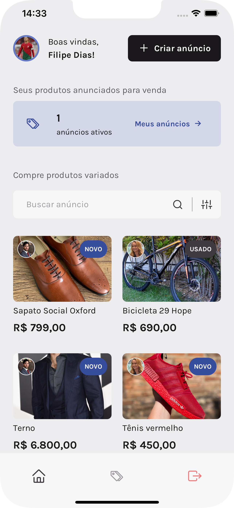
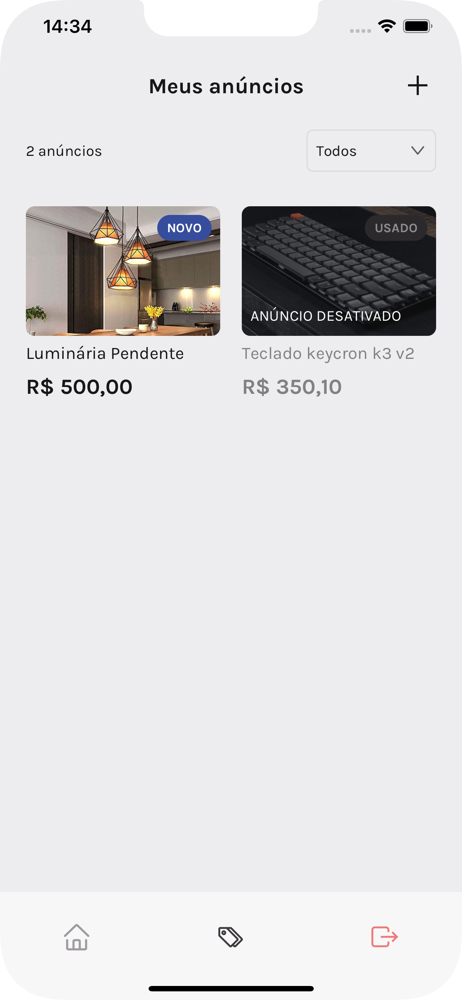
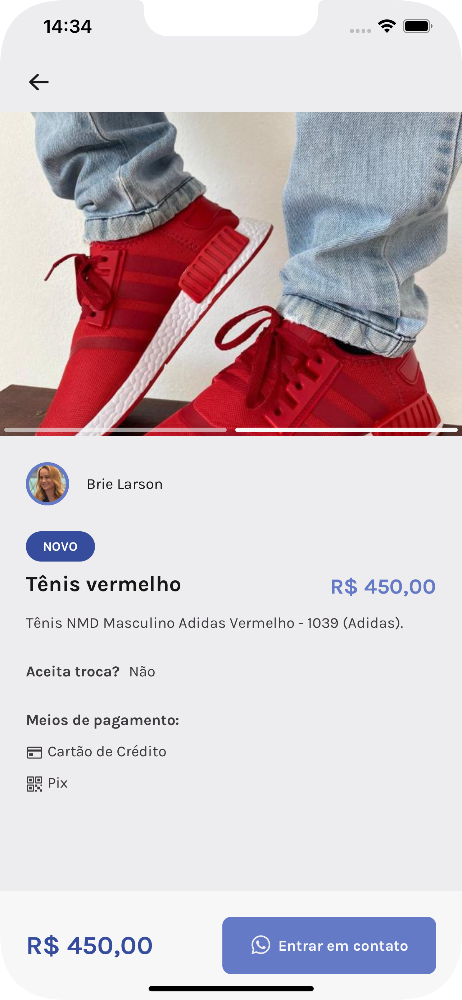
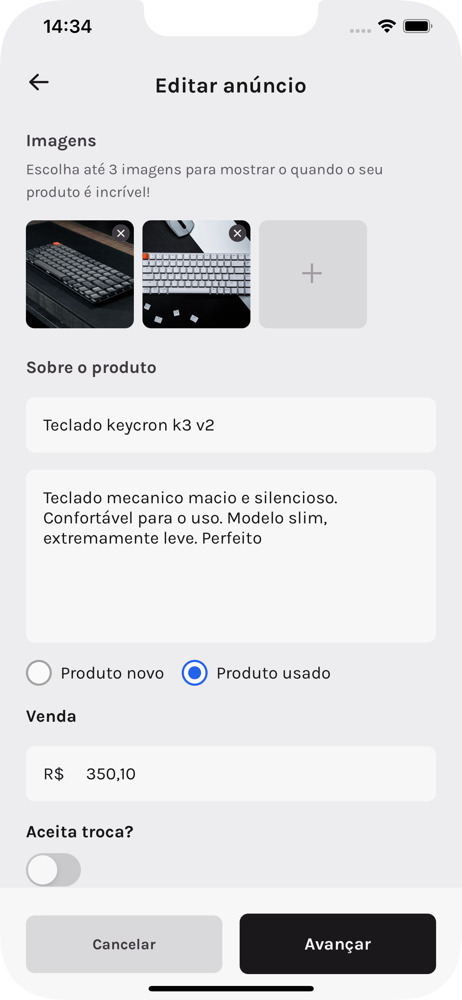
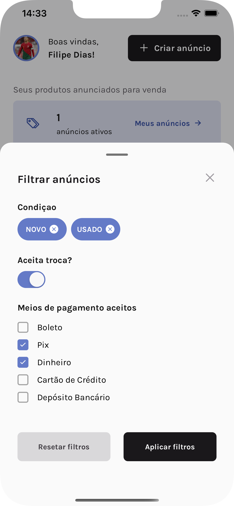

<h1 align="center">
  
</h1>

<h5 align="center">Tá precisando vender alguma coisa ou comprar? Esse app é para você.</h5>
<h6 align="center">Caso queira ver um vídeo do app rodando, acesse o link abaixo e deixa a curtida se puder, obg:</h6>
<h6 align="center"><a href="https://www.linkedin.com/posts/filipediaslima_react-reactnative-rocketseat-activity-7025477756087844864--e0_?utm_source=share&utm_medium=member_desktop">Marketspace App</a></h6>
<br/>

<h2 align="center">
 
 
 
</h2>

<br/>

# :rocket: Techs

* [React Native](https://reactnative.dev/)
* [Expo](https://expo.io/)
* [Native Base](https://nativebase.io/)
* [NodeJS](https://nodejs.org/en/)
* [Sqlite3](https://sqlite.org)
* [Typescript](https://www.typescriptlang.org)
* [React Reanimated Carousel](https://github.com/dohooo/react-native-reanimated-carousel)

<br/>

# :computer: Como rodar

```
# Clone do repositório
Faça o clone da aplicação
$ git clone https://github.com/FilipeDiasLima/marketspace.git
```

# O que é o app?

<p>O app marketspace é um aplicativo mobile Android e iOS que permite você comprar novos produtos e vender os seus. Nele você 
conta com um perfil e sua área de produtos cadastrados, podendo desativar, editar, remover e adicionar novos produtos. Caso queira 
comprar um produto, você escolhe ou filtra e entra em contato com o vendedor.</p>

# Rodando o projeto mobile

```
### Para rodar aplicação mobile, será necessário o EXPO

# Navegue até a pasta
$ cd marketspace

# Instale as dependencias
$ cd ./mobile && yarn
$ cd ./api && yarn

# Execute o comando
$ cd ./mobile && expo start
$ cd ./api && yarn start
```
# Mais

<div align="center">
 
 
 
</div>
